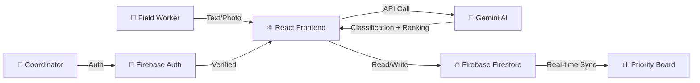

# 🎤 Smart Resource Allocation — Presentation Guide

> **Google Solutions Challenge 2026**
> A live demo script for presenting the AI-Powered NGO Coordination Platform

---

## 🎯 Opening (1 min)

### The Problem Statement

> *"When a disaster strikes, NGO field workers report crises on paper. Coordinators manually read reports, guess the urgency, and spend hours calling volunteers. People who need help the most... wait the longest."*

**Key stat to share:**
> According to OCHA (UN Office for the Coordination of Humanitarian Affairs), poor coordination during humanitarian crises leads to duplicated efforts and gaps in service delivery affecting **millions of people** globally.

### The Solution (One Sentence)

> *"Smart Resource Allocation is a real-time web platform where Google Gemini AI reads field reports, classifies urgency instantly, and dispatches the right volunteer — in seconds, not hours."*

---

## 🌍 UN SDGs Alignment (1 min)

Present these three goals and how the project addresses each:

| SDG | Goal | How We Address It |
|---|---|---|
| 🏥 **SDG 3** | Good Health & Well-Being | AI-prioritized medical emergency dispatch ensures critical health crises get immediate volunteer attention |
| 🏙️ **SDG 11** | Sustainable Cities & Communities | Real-time coordination strengthens disaster resilience and crisis response at the community level |
| 🤝 **SDG 17** | Partnerships for the Goals | Multi-stakeholder system connecting NGOs, field workers, and volunteers through a shared AI-powered dashboard |

> **Tip:** Mention a real example — *"Imagine a snakebite victim in Annigeri village needs emergency transport. Our AI classifies this as HIGH urgency in 3 seconds and immediately shows which volunteer with first-aid skills and a vehicle is available."*

---

## 🖥️ Live Demo Script (5-7 min)

### Demo 1: The Priority Board (1 min)

**What to show:** Open `http://localhost:5174/` → Priority Board

**Talk track:**
> *"This is the Priority Board — the nerve center for any NGO coordinator. Right now you can see 30 active needs across our deployment area."*

**Point out:**
- **Status bar** at top: `7 High Priority · 20 Open · 6 Free · 9 Busy`
- **Filter tabs**: All (30) → Open (20) → Assigned (3) → In Progress (3) → Resolved (4)
- **Color-coded cards**: Red border = HIGH, Yellow = MEDIUM, Teal = LOW
- **Staffing bars** on each card: `👥 2/5 volunteers` with progress indicator

### Demo 2: Submit a New Need via Text (2 min)

**What to do:** Click **Submit Need** tab → Fill in the text form

**Sample input to type live:**
| Field | Value |
|---|---|
| Location | *Kalghatgi Road, Dharwad* |
| Description | *Flooding near the bridge. 30 families trapped. Need boats and rescue team immediately.* |
| Affected Group | *Families near the riverbank* |
| Reporter | *Panchayat Secretary* |

**Talk track as AI processes:**
> *"Watch what happens when I submit — Google Gemini AI reads this description and in about 3 seconds..."*

**AI returns:**
- **Urgency**: HIGH ← *"The AI understood 'families trapped' means life-threatening"*
- **Type**: Safety ← *"Correctly categorized as a safety/rescue need"*
- **Volunteers Needed**: 5 ← *"The AI estimated the scale from '30 families' and recommended 5 volunteers"*
- **Confidence**: High

> *"No human had to read this and decide. The AI did it instantly, and it's now the #1 item on the board."*

### Demo 3: Submit via OCR — Photo of Handwritten Report (1.5 min)

**What to do:** Click the **OCR** tab → Upload a photo of a handwritten field report

**Talk track:**
> *"Field workers in rural areas often write reports by hand — sometimes in Hindi, Kannada, or mixed languages. Our AI handles all of this."*

**Point out after OCR:**
- Extracted fields are pre-filled in a review card
- User can edit before confirming
- Gemini Vision handles messy handwriting and multi-language text
- Any unreadable portions are flagged transparently

### Demo 4: Volunteer Management & AI Assignment (2 min)

**What to do:** Sign in → Click **Volunteers** tab

**Talk track:**
> *"Here's where the magic of coordination happens. We have 15 registered volunteers — each with specific skills, zones, and availability status."*

**Point out:**
- **Status counts**: `🟢 6 Free · 🔴 9 Busy`
- **Skill tags** on each volunteer card (Nursing, Construction, Driving, etc.)
- **Zone tracking**: Hubli, Dharwad, Gadag, Belgaum
- **Task history**: "12 tasks completed" shows experience level

**Now show AI Auto-Assign:**
1. Go back to **Priority Board** → Click an **open HIGH priority** need
2. Click **"👥 Assign Volunteers"** in the modal
3. Show the **🤖 AI Auto-Assign** button with gradient animation
4. Click it → AI picks the best volunteers and assigns them
5. **Reasoning popup appears** → Read out the AI's explanation

> *"The AI looked at the skill requirements for this need, cross-referenced each volunteer's skills, zone proximity, and experience level, and chose the best match. And it tells us WHY — in plain English."*

**Alternative: Manual assign**
> *"Coordinators can also manually pick from the ranked list if they prefer — AI is a tool, not a replacement for human judgment."*

### Demo 5: Resolution & Lifecycle (1 min)

**What to do:** Click a need in **In Progress** → Click **✅ Resolve**

**Talk track:**
> *"When a need is resolved, the system automatically frees all assigned volunteers — they go back to 'available' in real-time. The resolved card permanently shows who completed it."*

**Click on a Resolved card to show:**
- **"✅ Completed by"** section with volunteer names and green ✓ done tags
- No progress bar (task is finished)
- Full audit trail preserved

---

## 🧠 Technical Deep Dive (2 min)

### Architecture Diagram

### Google Technologies Used

| Layer | Technology | Purpose |
|---|---|---|
| **AI Engine** | Google Gemini (`gemini-2.0-flash`) | 4 AI prompts: classify, OCR extract, estimate volunteers, rank matches |
| **Database** | Firebase Firestore | Real-time sync with `onSnapshot` — board updates live for all users |
| **Auth** | Firebase Authentication | Google Sign-In — only verified NGO workers can modify data |
| **Hosting** | Firebase Hosting | Zero-config deployment with CDN |

### 4 AI Prompts (Key Technical Detail)

| # | Prompt | Input | Output |
|---|---|---|---|
| 1 | **Text Classification** | Free-text description | `{ urgency, needType, aiReason, volunteersNeeded }` |
| 2 | **OCR Extraction** | Base64 photo of handwritten form | `{ location, description, affectedGroup, reporterName }` |
| 3 | **Volunteer Count Estimation** | Need description + scale | `volunteersNeeded` (integer) |
| 4 | **Volunteer Ranking** | Need details + available volunteer profiles | Ranked list + reasoning |

### Security Architecture

- **Firestore Rules**: Write operations locked behind Firebase Auth — public board is read-only
- **Atomic Transactions**: Multi-volunteer assignments use Firestore transactions — no race conditions when two coordinators assign simultaneously
- **Cascading Cleanup**: Deleting a volunteer automatically removes them from all assigned needs; resolving a need frees all volunteers

---

## 📊 Impact Metrics (1 min)

| Metric | Manual Process | With Our AI | Improvement |
|---|---|---|---|
| **Need Classification** | ~5 min per report | **~3 seconds** | **100x faster** |
| **Volunteer Matching** | Hours of phone calls | **One click** — AI evaluates all | **Eliminates guesswork** |
| **Field Report Digitization** | 10-15 min manual entry | **Instant OCR** — snap a photo | **Zero typing** |
| **Volunteer Coordination** | Spreadsheets, WhatsApp groups | **Real-time roster** with free/busy tracking | **Live visibility** |
| **Coordination Errors** | Duplicate dispatches, missed crises | **Atomic transactions** + status tracking | **Zero double-bookings** |

---

## 🗺️ Future Roadmap (30 sec)

| Phase | Feature | Status |
|---|---|---|
| **v1.0** | AI classification, OCR, volunteer matching | ✅ Complete |
| **v1.5** | Volunteer roster, multi-assign, AI auto-assign | ✅ Complete |
| **v2.0** | Multi-language UI (Hindi, Kannada, Telugu) | 🔜 Planned |
| **v2.1** | Offline PWA for low-connectivity field areas | 🔜 Planned |
| **v2.2** | WhatsApp bot integration for need reporting | 🔜 Planned |
| **v3.0** | Admin analytics dashboard + crisis trend maps | 🔜 Planned |

---

## ❓ Anticipated Q&A

### "How does the AI decide urgency?"
> The Gemini prompt uses zero-shot classification with a strict JSON schema. It looks for keywords indicating life-threat (HIGH), significant impact (MEDIUM), or quality-of-life improvements (LOW). The confidence score reflects how clear-cut the classification was.

### "What if the AI gets it wrong?"
> Every AI classification is editable. Coordinators can change urgency, type, and volunteer estimates. The AI is a recommendation engine — humans have final say.

### "Does it work offline?"
> Currently requires internet for AI calls and Firestore sync. PWA mode with local-first storage is on our v2.1 roadmap — critical for rural field workers.

### "How do you handle multiple NGOs?"
> Currently single-tenant. Multi-NGO tenancy with isolated boards is planned for v3.0. The architecture (Firebase Auth + Firestore collections) supports it cleanly.

### "What about data privacy?"
> Need descriptions are processed by Gemini API but not stored by Google. All data lives in your own Firebase project. Firestore rules ensure only authenticated users can write.

### "How do you prevent two coordinators from assigning the same volunteer?"
> Firestore transactions with server-side checks. If a volunteer was already assigned between when Coordinator A opened the panel and clicked assign, the transaction fails gracefully and shows an error.

---

## 🎬 Closing Statement (30 sec)

> *"In a real crisis, every minute matters. Smart Resource Allocation eliminates the coordination bottleneck by letting AI handle the triage while humans focus on what they do best — helping people. With Google Gemini for intelligence and Firebase for real-time coordination, we've built a platform that can scale from a single NGO to a national disaster response network."*

> *"Thank you."*

---

## 📋 Pre-Presentation Checklist

- [ ] Run `node scripts/seed.js` to ensure fresh, diverse data
- [ ] Run `npm run dev` and verify board loads at `http://localhost:5174/`
- [ ] Confirm status bar shows: `7 High Priority · 20 Open · 6 Free · 9 Busy`
- [ ] Sign in with Google to unlock coordinator features
- [ ] Test Submit Need (text) → verify card appears on board
- [ ] Test OCR → have a photo of a handwritten form ready
- [ ] Test AI Auto-Assign → open a HIGH priority open need
- [ ] Have a backup of your `.env` file with all API keys
- [ ] Test on the projector/screen resolution before presenting
- [ ] Close unnecessary browser tabs and notifications
