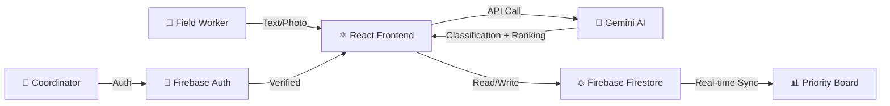
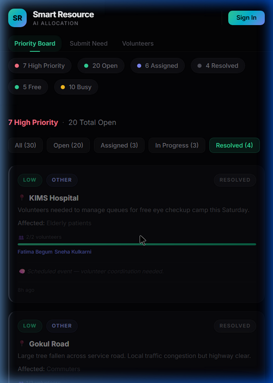
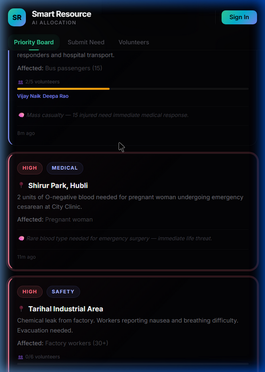

# Smart Resource Allocation
### AI-Powered Disaster & Community Need Management
#### Google Solutions Challenge 2026

---

## 🌍 The Problem

> During disasters and humanitarian crises, **aid delivery is slow, uncoordinated, and often misdirected.**

- NGOs receive hundreds of field reports daily — handwritten, WhatsApp messages, verbal
- No way to **prioritize** which needs are most urgent
- Volunteers are assigned **manually** with no skill-matching
- No visibility into who is **free vs busy** — coordinators rely on phone calls
- Duplicated efforts waste precious time and resources
- Communities wait **hours or days** for help that could arrive in minutes

**UN SDGs Addressed:**

| SDG | Goal | How We Address It |
|---|---|---|
| 🏥 **SDG 3** | Good Health & Well-Being | AI-prioritized medical emergency dispatch ensures critical health crises get immediate volunteer attention |
| 🏙️ **SDG 11** | Sustainable Cities & Communities | Real-time coordination strengthens disaster resilience and crisis response at the community level |
| 🤝 **SDG 17** | Partnerships for the Goals | Multi-stakeholder system connecting NGOs, field workers, and volunteers through a shared AI-powered dashboard |

---

## 💡 Our Solution

**Smart Resource Allocation** — A real-time AI platform that:

| Feature | How It Works |
|---------|-------------|
| 🧠 **AI Need Classification** | Gemini AI reads field reports and auto-classifies urgency (HIGH/MEDIUM/LOW), type (Medical, Food, Safety, Infrastructure), and estimates volunteers needed |
| 📸 **OCR Field Reports** | Upload photos of handwritten notes — AI extracts text and classifies automatically, even multilingual (English/Hindi/Kannada) |
| 👥 **Volunteer Roster & AI Auto-Assign** | Persistent volunteer roster with free/busy tracking. AI ranks and auto-assigns the best-fit volunteers based on skills, zone, and experience — with plain-English reasoning |
| 📊 **Live Priority Board** | Real-time dashboard with 30 needs across all statuses: Open, Assigned, In Progress, Resolved |
| 🔄 **Full Lifecycle Management** | Complete need lifecycle with edit, reassign, resolve (auto-frees volunteers), unresolve, and delete |
| 🔒 **Role-Based Access** | Public can view the board; only authenticated NGO workers can manage needs |

---

## 🏗️ Architecture



```
┌──────────────────────────────────────────────────┐
│                    Frontend                       │
│           React 18 + Vite + Vanilla CSS          │
│      Real-time Firestore listeners (onSnapshot)   │
└──────────────┬───────────────────┬───────────────┘
               │                   │
               ▼                   ▼
┌──────────────────┐   ┌─────────────────────┐
│  Google Gemini   │   │  Firebase Platform  │
│  AI/ML Engine    │   │                     │
│                  │   │  • Auth (Google)     │
│  • Classification│   │  • Firestore DB     │
│  • OCR Vision    │   │  • Hosting          │
│  • Vol. Estimate │   │  • Cloud Functions  │
│  • Skill Ranking │   │  • Security Rules   │
└──────────────────┘   └─────────────────────┘
```

---

## 🧠 4 AI Prompts Powering the Platform

| # | Prompt | Input | Output |
|---|--------|-------|--------|
| 1 | **Text Classification** | Free-text crisis description | `{ urgency, needType, aiReason, aiConfidence, volunteersNeeded }` |
| 2 | **OCR Vision Extraction** | Base64 photo of handwritten report | `{ location, description, affectedGroup, reporterName }` |
| 3 | **Volunteer Count Estimation** | Need description + affected scale | `volunteersNeeded` (integer) |
| 4 | **Volunteer Ranking** | Need details + all available volunteer profiles | Ranked list with match scores + reasoning |

---

## 🎯 Live Demo Flow

### Step 1: Public Priority Board
- Open the app — **anyone can view** the live needs board
- Status bar: `7 High Priority · 20 Open · 6 Free · 9 Busy`
- Filter tabs: All (30) → Open (20) → Assigned (3) → In Progress (3) → Resolved (4)
- Color-coded cards: red border = HIGH, yellow = MEDIUM, teal = LOW
- Each card shows staffing progress: `👥 2/5 volunteers` with a progress bar
- Click any card → full details, AI analysis, volunteer names



### Step 2: Sign In (Google Auth)
- Click "Sign In" → Google OAuth popup
- Now the Submit Need and Volunteers tabs unlock
- Need cards now show action buttons: Edit, Assign, Resolve, Delete

### Step 3: Submit a Need (Text)

**Sample input to type live:**

| Field | Value |
|---|---|
| Location | *Kalghatgi Road, Dharwad* |
| Description | *Flooding near the bridge. 30 families trapped. Need boats and rescue team immediately.* |
| Affected Group | *Families near the riverbank* |
| Reporter | *Panchayat Secretary* |

- Click "Classify & Submit"
- **Gemini AI** returns urgency + type + volunteer estimate + reasoning in ~3 seconds
- Need appears on the board instantly via real-time Firestore sync

### Step 4: Submit a Need (OCR)
- Upload a photo of a handwritten field report
- AI extracts all text (handles English, Hindi, Kannada), classifies, and pre-fills the form
- Review, edit if needed, confirm → added to board

### Step 5: Volunteer Roster
- View all **15 registered volunteers** with skills, zones, and status
- **🟢 Free / 🔴 Busy** indicators with task count
- Add new volunteers, edit profiles, or remove
- Each volunteer shows completed task history

### Step 6: AI Volunteer Assignment
- Open a HIGH priority need → click "Assign Volunteers"
- See AI-ranked volunteers with ⭐ Best Match labels
- Click **"🤖 AI Auto-Assign"** → AI picks the best available volunteers
- Reasoning popup: *"Selected Priya for her First Aid skills near Ward 5"*
- **Or** manually pick volunteers from the ranked list — human override always available

### Step 7: Status Lifecycle
- **Open** → Assign volunteers → **Assigned**
- Mark **In Progress** → Work being done
- Click **✅ Resolve** → Volunteers automatically freed, tasks completed count +1
- Resolved cards show **"✅ Completed by"** with volunteer names and ✓ done tags
- Full rollback: Unresolve, Deassign, Edit at any stage



---

## 🛡️ Security & Data Integrity

| Layer | Protection |
|-------|-----------|
| **Firebase Auth** | Google Sign-In required for all write operations |
| **Firestore Rules** | `allow read: if true` (public board) · `allow write: if request.auth != null` |
| **Frontend Auth-Gate** | Action buttons hidden for non-authenticated users |
| **Duplicate Prevention** | Queries before insert — same need can't be submitted twice |
| **Transactions** | All volunteer assignments use Firestore transactions for atomicity |
| **Race Conditions** | Transaction-based status checks prevent double-assignment |
| **Cascading Cleanup** | Resolving a need auto-frees all volunteers; deleting a volunteer removes them from all needs |

---

## 📊 Impact Metrics

| Metric | Manual Process | With Our AI | Improvement |
|---|---|---|---|
| **Need Classification** | ~5 min per report | **~3 seconds** | **100x faster** |
| **Volunteer Matching** | Hours of phone calls | **One click** — AI evaluates all | **Eliminates guesswork** |
| **Field Report Digitization** | 10-15 min manual entry | **Instant OCR** — snap a photo | **Zero typing** |
| **Volunteer Coordination** | Spreadsheets, WhatsApp groups | **Real-time roster** with free/busy tracking | **Live visibility** |
| **Coordination Errors** | Duplicate dispatches, missed crises | **Atomic transactions** + status tracking | **Zero double-bookings** |
| **Decision Transparency** | None | **Full AI reasoning for every action** | **Complete audit trail** |

---

## 🔧 Tech Stack

| Component | Technology |
|-----------|-----------|
| Frontend | React 18 + Vite |
| Styling | Vanilla CSS + Custom Design System |
| AI Engine | Google Gemini 2.0 Flash (4 prompts) |
| Database | Cloud Firestore (real-time sync) |
| Auth | Firebase Authentication (Google Sign-In) |
| Hosting | Firebase Hosting |
| Backend | Firebase Cloud Functions |
| Seed Data | 15 volunteers · 30 needs · cross-linked assignments |

---

## 🚀 What Makes This Different

1. **AI at Every Step** — Not just a CRUD app. Gemini AI classifies, estimates, matches, and explains every decision
2. **Persistent Volunteer Roster** — Real free/busy tracking with skills, zones, and task history — not just one-shot matching
3. **AI Auto-Assign with Reasoning** — One click to dispatch the best volunteers, with a plain-English explanation of why
4. **Real-Time Collaboration** — Multiple NGO workers see updates instantly via Firestore listeners
5. **OCR for Field Reality** — Handwritten reports in multiple languages → structured, prioritized data
6. **Full Lifecycle** — Open → Assigned → In Progress → Resolved, with rollback at every step
7. **Production Security** — Auth-gated writes, transaction-based assignments, cascading cleanup
8. **Zero-Cost Deployment** — Runs entirely on Firebase free tier

---

## ❓ Anticipated Q&A

### "How does the AI decide urgency?"
> The Gemini prompt uses zero-shot classification with a strict JSON schema. It looks for keywords indicating life-threat (HIGH), significant impact (MEDIUM), or quality-of-life improvements (LOW). The confidence score reflects how clear-cut the classification was.

### "What if the AI gets it wrong?"
> Every AI classification is editable. Coordinators can change urgency, type, and volunteer estimates. The AI is a recommendation engine — humans have final say.

### "Does it work offline?"
> Currently requires internet for AI calls and Firestore sync. PWA mode with local-first storage is on our v2.1 roadmap — critical for rural field workers.

### "How do you handle multiple NGOs?"
> Currently single-tenant. Multi-NGO tenancy with isolated boards is planned for v3.0. The architecture (Firebase Auth + Firestore collections) supports it cleanly.

### "What about data privacy?"
> Need descriptions are processed by Gemini API but not stored by Google. All data lives in your own Firebase project. Firestore rules ensure only authenticated users can write.

### "How do you prevent two coordinators from assigning the same volunteer?"
> Firestore transactions with server-side checks. If a volunteer was already assigned between when Coordinator A opened the panel and clicked assign, the transaction fails gracefully and shows an error.

---

## 🗺️ Future Roadmap

| Phase | Feature | Status |
|---|---|---|
| **v1.0** | AI classification, OCR, volunteer matching | ✅ Complete |
| **v1.5** | Volunteer roster, multi-assign, AI auto-assign | ✅ Complete |
| **v2.0** | Multi-language UI (Hindi, Kannada, Telugu) | 🔜 Planned |
| **v2.1** | Offline PWA for low-connectivity field areas | 🔜 Planned |
| **v2.2** | WhatsApp bot integration for need reporting | 🔜 Planned |
| **v3.0** | Admin analytics dashboard + crisis trend maps | 🔜 Planned |

---

## 🎬 Closing

> *"In a real crisis, every minute matters. Smart Resource Allocation eliminates the coordination bottleneck by letting AI handle the triage while humans focus on what they do best — helping people. With Google Gemini for intelligence and Firebase for real-time coordination, we've built a platform that can scale from a single NGO to a national disaster response network."*

> *"Thank you."*

**Smart Resource Allocation**
*AI-powered community need management for faster, smarter disaster response*

Built with ❤️ using Google technologies
**Google Solutions Challenge 2026**
