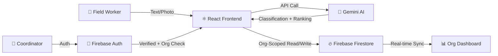

# 🎤 AidFlow — Presentation Guide

> **Google Solutions Challenge 2026**
> A live demo script for presenting the AI-Powered Multi-NGO Coordination Platform

---

## 🎯 Opening (1 min)

### The Problem Statement

> *"When a disaster strikes, NGO field workers report crises on paper. Coordinators manually read reports, guess the urgency, and spend hours calling volunteers. People who need help the most... wait the longest."*

**Key stat to share:**
> According to OCHA (UN Office for the Coordination of Humanitarian Affairs), poor coordination during humanitarian crises leads to duplicated efforts and gaps in service delivery affecting **millions of people** globally.

### The Solution (One Sentence)

> *"AidFlow is a real-time web platform where Google Gemini AI reads field reports, classifies urgency instantly, and dispatches the right volunteer — in seconds, not hours."*

---

## 🌍 UN SDGs Alignment (1 min)

Present these three goals and how the project addresses each:

| SDG | Goal | How We Address It |
|---|---|---|
| 🏥 **SDG 3** | Good Health & Well-Being | AI-prioritized medical emergency dispatch ensures critical health crises get immediate volunteer attention |
| 🏙️ **SDG 11** | Sustainable Cities & Communities | Real-time coordination strengthens disaster resilience and crisis response at the community level |
| 🤝 **SDG 17** | Partnerships for the Goals | Multi-NGO system connecting independent organizations, field workers, and volunteers through isolated AI-powered dashboards |

> **Tip:** Mention a real example — *"Imagine a snakebite victim in Annigeri village needs emergency transport. Our AI classifies this as HIGH urgency in 3 seconds and immediately shows which volunteer with first-aid skills and a vehicle is available."*

---

## 🖥️ Live Demo Script (7-9 min)

### Demo 1: Welcome & Authentication (1 min)

**What to show:** Open `http://localhost:5173/` in an incognito window

**Talk track:**
> *"First, notice that without logging in, you see a Welcome page — not a dashboard. No data is exposed. Each NGO's data is completely isolated — you must authenticate and select your organization to see anything."*

**Point out:**
- The Welcome landing page explains the platform
- Feature highlights: AI Classification, Smart Matching, Multi-NGO Isolation
- No needs or volunteers are visible to unauthenticated users

**Now sign in:**
- Click **Sign in with Google** → complete OAuth
- The **OrgPicker** appears — *"Now I need to select or join my organization"*

### Demo 2: PIN-Based Organization Joining (1.5 min)

**What to do:** In the OrgPicker, click **"Browse & Join"** tab → select **Dharwad Relief Network**

**Talk track:**
> *"Each NGO gets a completely private workspace. Notice the Browse & Join tab — I can see all registered organizations, but I need a PIN to enter any of them. This prevents unauthorized access."*

**Steps:**
1. Click **Dharwad Relief Network** in the browse list
2. **PIN prompt** appears with a lock icon (🔐)
3. Enter PIN: **`1234`** → Click **Join**
4. Dashboard loads with pre-populated data

**Pre-seeded demo PINs:**
| Organization | PIN |
|---|---|
| Dharwad Relief Network | `1234` |
| Mumbai Health Initiative | `5678` |
| Bengaluru Community Aid | `9012` |

**Point out:**
- Org badge appears in the header showing **"Dharwad Relief..."**
- Dashboard is already populated: **12 needs** across all urgency levels, **8 volunteers**
- Status bar shows live counts — High priority, Open, Assigned, Resolved
- Needs span multiple statuses: open, assigned, in-progress, resolved

> *"In real life, each NGO operates independently. The Red Cross doesn't see Doctors Without Borders' internal data. Our platform enforces this at the database level — and each org is PIN-protected."*

### Demo 3: Submit a New Need via Text (2 min)

**What to do:** Click **Submit Need** tab → Fill in the text form

**Sample input to type live:**
| Field | Value |
|---|---|
| Location | *Kalghatgi Road, Dharwad* |
| Description | *Flooding near the bridge. 30 families trapped. Need boats and rescue team immediately.* |
| Affected Group | *Families near the riverbank* |
| Reporter | *Panchayat Secretary* |

**Talk track as AI processes:**
> *"Watch what happens when I submit — Google Gemini AI reads this description and in about 3 seconds..."*

**AI returns:**
- **Urgency**: HIGH ← *"The AI understood 'families trapped' means life-threatening"*
- **Type**: Safety ← *"Correctly categorized as a safety/rescue need"*
- **Volunteers Needed**: 5 ← *"The AI estimated the scale from '30 families' and recommended 5 volunteers"*
- **Confidence**: High

> *"No human had to read this and decide. The AI did it instantly, and it's now the #1 item on our org's board."*

### Demo 4: Submit via OCR — Photo of Handwritten Report (1.5 min)

**What to do:** Click the **OCR** tab → Upload a photo of a handwritten field report

**Talk track:**
> *"Field workers in rural areas often write reports by hand — sometimes in Hindi, Kannada, or mixed languages. Our AI handles all of this."*

**Point out after OCR:**
- Extracted fields are pre-filled in a review card
- User can edit before confirming
- Gemini Vision handles messy handwriting and multi-language text
- Any unreadable portions are flagged transparently

### Demo 5: Volunteer Management & AI Assignment (2 min)

**What to do:** Click **Volunteers** tab

**Talk track:**
> *"Here's where the magic of coordination happens. Let me register a volunteer for this organization."*

**Register a volunteer live, then point out:**
- **Status indicators**: 🟢 Free / 🔴 Busy
- **Skill tags** on each volunteer card
- **Zone tracking**: location-based matching
- All volunteers belong to THIS org only

**Now show AI Auto-Assign:**
1. Go back to **Priority Board** → Click the open HIGH priority need
2. Click **"👥 Assign Volunteers"** in the modal
3. Show the **🤖 AI Auto-Assign** button with gradient animation
4. Click it → AI picks the best volunteers and assigns them
5. **Reasoning popup appears** → Read out the AI's explanation

> *"The AI looked at the skill requirements for this need, cross-referenced each volunteer's skills, zone proximity, and experience level, and chose the best match. And it tells us WHY — in plain English."*

**Alternative: Manual assign**
> *"Coordinators can also manually pick from the ranked list if they prefer — AI is a tool, not a replacement for human judgment."*

### Demo 6: Resolution & Lifecycle (1 min)

**What to do:** Click an assigned/in-progress need → Click **✅ Resolve**

**Talk track:**
> *"When a need is resolved, the system automatically frees all assigned volunteers — they go back to 'available' in real-time. The resolved card permanently shows who completed it."*

**Click on a Resolved card to show:**
- **"✅ Completed by"** section with volunteer names and green ✓ done tags
- No progress bar (task is finished)
- Full audit trail preserved

### Demo 7: Multi-NGO Isolation ⭐ KEY MOMENT (1.5 min)

**What to do:** Click the org badge → **Change Organization** → Join **Mumbai Health Initiative** (PIN: `5678`)

**Talk track:**
> *"Now here's the most important thing — watch what happens when I switch to a different organization."*

**Steps:**
1. Click org badge in header → click **"Change Organization"**
2. Browse list shows remaining orgs → click **Mumbai Health Initiative**
3. Enter PIN: **`5678`** → Join
4. Dashboard loads with **completely different data**

**Point out:**
- Mumbai has **10 needs** and **6 volunteers** — entirely different from Dharwad's 12 needs and 8 volunteers
- Different locations (Dharavi, Andheri, Bandra — Mumbai locations)
- Different volunteers (Dr. Sameer Kapoor, Nisha Agarwal — Mumbai team)
- **Zero overlap** with Dharwad data

> *"Two NGOs, completely isolated. Dharwad Relief Network's data stays in Dharwad. Mumbai Health Initiative has its own team, its own crises, its own dashboard. This is real multi-tenancy — not just a filter, but genuine organizational isolation, protected by PIN access."*

**Switch back to Dharwad:**
- Click org badge → **"Dharwad Relief Network"** is now in the "Your Organizations" section
- One click to switch back — all Dharwad data reappears instantly

> *"And when I switch back — everything is exactly where I left it. Each org is a separate, private workspace."*

**Bonus — show the third org:**
> *"We even have a third org — Bengaluru Community Aid (PIN: 9012) — with 5 volunteers and 8 needs from Bengaluru. Three cities, three NGOs, zero data leakage."*

---

## 🧠 Technical Deep Dive (2 min)

### Architecture Diagram

### Google Technologies Used

| Layer | Technology | Purpose |
|---|---|---|
| **AI Engine** | Google Gemini (`gemini-2.0-flash`) | 4 AI prompts: classify, OCR extract, estimate volunteers, rank matches |
| **Database** | Firebase Firestore | Real-time sync with `onSnapshot` — board updates live for all users |
| **Auth** | Firebase Authentication | Google Sign-In — only verified NGO workers can modify data |
| **Hosting** | Firebase Hosting | Zero-config deployment with CDN |

### 4 AI Prompts (Key Technical Detail)

| # | Prompt | Input | Output |
|---|---|---|---|
| 1 | **Text Classification** | Free-text description | `{ urgency, needType, aiReason, volunteersNeeded }` |
| 2 | **OCR Extraction** | Base64 photo of handwritten form | `{ location, description, affectedGroup, reporterName }` |
| 3 | **Volunteer Count Estimation** | Need description + scale | `volunteersNeeded` (integer) |
| 4 | **Volunteer Ranking** | Need details + available volunteer profiles | Ranked list + reasoning |

### Security Architecture

- **Multi-Tenant Isolation**: Each NGO's data is scoped by `orgId` — no cross-org queries exist in the codebase
- **PIN-Protected Access**: Each organization has a 4-digit PIN — prevents unauthorized users from joining
- **Authentication Gate**: All views require login + org selection — unauthenticated users see only the Welcome page
- **Firestore Rules**: Organizations collection has member-only write access; needs/volunteers filtered by org
- **Atomic Transactions**: Multi-volunteer assignments use Firestore transactions — no race conditions when two coordinators assign simultaneously
- **Cascading Cleanup**: Deleting a volunteer automatically removes them from all assigned needs; resolving a need frees all volunteers

---

## 📊 Impact Metrics (1 min)

| Metric | Manual Process | With Our AI | Improvement |
|---|---|---|---|
| **Need Classification** | ~5 min per report | **~3 seconds** | **100x faster** |
| **Volunteer Matching** | Hours of phone calls | **One click** — AI evaluates all | **Eliminates guesswork** |
| **Field Report Digitization** | 10-15 min manual entry | **Instant OCR** — snap a photo | **Zero typing** |
| **Volunteer Coordination** | Spreadsheets, WhatsApp groups | **Real-time roster** with free/busy tracking | **Live visibility** |
| **Coordination Errors** | Duplicate dispatches, missed crises | **Atomic transactions** + status tracking | **Zero double-bookings** |

---

## 🗺️ Future Roadmap (30 sec)

| Phase | Feature | Status |
|---|---|---|
| **v1.0** | AI classification, OCR, volunteer matching | ✅ Complete |
| **v1.5** | Volunteer roster, multi-assign, AI auto-assign | ✅ Complete |
| **v2.0** | Multi-NGO support with full tenant isolation | ✅ Complete |
| **v2.1** | PIN-protected org access + browse/join flow + demo seeding | ✅ Complete |
| **v2.5** | Multi-language UI (Hindi, Kannada, Telugu) | 🔜 Planned |
| **v3.0** | Offline PWA for low-connectivity field areas | 🔜 Planned |
| **v3.1** | WhatsApp bot integration for need reporting | 🔜 Planned |
| **v4.0** | Admin analytics dashboard + crisis trend maps | 🔜 Planned |

---

## ❓ Anticipated Q&A

### "How does the AI decide urgency?"
> The Gemini prompt uses zero-shot classification with a strict JSON schema. It looks for keywords indicating life-threat (HIGH), significant impact (MEDIUM), or quality-of-life improvements (LOW). The confidence score reflects how clear-cut the classification was.

### "What if the AI gets it wrong?"
> Every AI classification is editable. Coordinators can change urgency, type, and volunteer estimates. The AI is a recommendation engine — humans have final say.

### "Does it work offline?"
> Currently requires internet for AI calls and Firestore sync. PWA mode with local-first storage is on our v2.1 roadmap — critical for rural field workers.

### "How do you handle multiple NGOs?"
> Each NGO gets a fully isolated, PIN-protected workspace. All data — needs, volunteers, assignments — is scoped by organization ID at the Firestore query level. No cross-org queries exist in the codebase. Users browse available orgs in a searchable directory and must enter a 4-digit PIN to join. Once joined, members can switch between their orgs via the header badge. Data never leaks between organizations.

### "What about data privacy?"
> Need descriptions are processed by Gemini API but not stored by Google. All data lives in your own Firebase project. Firestore rules ensure only authenticated users can write.

### "How do you prevent two coordinators from assigning the same volunteer?"
> Firestore transactions with server-side checks. If a volunteer was already assigned between when Coordinator A opened the panel and clicked assign, the transaction fails gracefully and shows an error.

---

## 🎬 Closing Statement (30 sec)

> *"In a real crisis, every minute matters. AidFlow eliminates the coordination bottleneck by letting AI handle the triage while humans focus on what they do best — helping people. Each NGO gets its own isolated workspace — no data leaks, no cross-org visibility. With Google Gemini for intelligence, Firebase for real-time coordination, and true multi-tenant isolation, we've built a platform that can scale from a single NGO to a national disaster response network."*

> *"Thank you."*

---

## 📋 Pre-Presentation Checklist

- [ ] Run `node scripts/seed-demo.js` to populate demo data (3 orgs with PINs)
- [ ] Run `npm run dev` and verify app loads at `http://localhost:5173/`
- [ ] Verify Welcome landing page appears (not logged in)
- [ ] Sign in with Google → verify OrgPicker with **Browse & Join** tab shows 3 orgs
- [ ] Join **Dharwad Relief Network** (PIN: `1234`) → verify 12 needs + 8 volunteers load
- [ ] Submit a new need (text) → verify card appears on org's board
- [ ] Test AI Auto-Assign → open an open HIGH priority need and assign
- [ ] Test OCR → have a photo of a handwritten form ready
- [ ] Change org → Join **Mumbai Health Initiative** (PIN: `5678`) → verify different data (10 needs, 6 volunteers)
- [ ] Switch back to Dharwad → verify original data persists
- [ ] Optionally join **Bengaluru Community Aid** (PIN: `9012`) for a third isolation demo
- [ ] Have a backup of your `.env` file with all API keys
- [ ] Test on the projector/screen resolution before presenting
- [ ] Close unnecessary browser tabs and notifications

**Demo PINs Quick Reference:**
| Organization | PIN |
|---|---|
| Dharwad Relief Network | `1234` |
| Mumbai Health Initiative | `5678` |
| Bengaluru Community Aid | `9012` |
