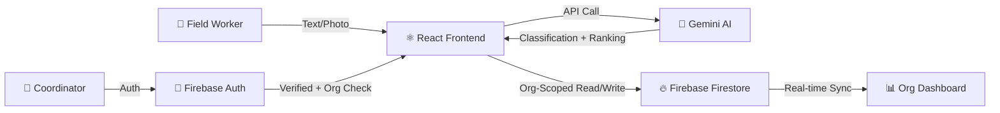

# AidFlow
### AI-Powered Multi-NGO Disaster & Community Need Management
#### Google Solutions Challenge 2026

---

## 🌍 The Problem

> During disasters and humanitarian crises, **aid delivery is slow, uncoordinated, and often misdirected.**

- NGOs receive hundreds of field reports daily — handwritten, WhatsApp messages, verbal
- No way to **prioritize** which needs are most urgent
- Volunteers are assigned **manually** with no skill-matching
- No visibility into who is **free vs busy** — coordinators rely on phone calls
- Duplicated efforts waste precious time and resources
- Communities wait **hours or days** for help that could arrive in minutes

**UN SDGs Addressed:**

| SDG | Goal | How We Address It |
|---|---|---|
| 🏥 **SDG 3** | Good Health & Well-Being | AI-prioritized medical emergency dispatch ensures critical health crises get immediate volunteer attention |
| 🏙️ **SDG 11** | Sustainable Cities & Communities | Real-time coordination strengthens disaster resilience and crisis response at the community level |
| 🤝 **SDG 17** | Partnerships for the Goals | Multi-NGO system connecting independent organizations, field workers, and volunteers through isolated AI-powered dashboards |

---

## 💡 Our Solution

**AidFlow** — A real-time AI platform that:

| Feature | How It Works |
|---------|-------------|
| 🧠 **Adaptive AI Learning Loop** | Gemini AI doesn't just classify—it learns. When coordinators override AI classifications, it feeds into an org-specific few-shot vector. The AI adapts to each NGO's unique standard of "High Urgency". |
| 🎙️ **Multilingual Voice-to-Need** | Field workers speak directly into the app (Hindi, Kannada, Telugu, English). AI transcribes and structures chaotic audio into prioritized data instantly. |
| 🔗 **AI Crisis Deduplication** | As new reports flow in, AI semantically compares them against active crises. It clusters duplicates and related reports, preventing redundant volunteer dispatch. |
| 🤖 **AI Volunteer Auto-Assign** | Persistent volunteer roster with free/busy tracking. AI ranks and auto-assigns the best-fit volunteers based on skills, zone, and experience — with plain-English reasoning |
| 🏢 **Multi-NGO Isolation** | Each organization gets a PIN-protected private workspace — needs, volunteers, and stats are fully scoped. No cross-org visibility. Browse, join with PIN, or create orgs instantly |
| 📊 **Live Priority Board** | Real-time org-scoped dashboard with needs across all statuses: Open, Assigned, In Progress, Resolved |
| 🔄 **Full Lifecycle Management** | Complete need lifecycle with edit, reassign, resolve (auto-frees volunteers), unresolve, and delete |
| 🔒 **Authentication Gate** | All views require login + org selection — unauthenticated users see only a Welcome page |

---

## 🏗️ Architecture



```
┌──────────────────────────────────────────────────┐
│                    Frontend                       │
│           React 18 + Vite + Vanilla CSS          │
│      Real-time Firestore listeners (onSnapshot)   │
└──────────────┬───────────────────┬───────────────┘
               │                   │
               ▼                   ▼
┌──────────────────┐   ┌─────────────────────┐
│  Google Gemini   │   │  Firebase Platform  │
│  AI/ML Engine    │   │                     │
│                  │   │  • Auth (Google)     │
│  • Classification│   │  • Firestore DB     │
│  • OCR Vision    │   │  • Hosting          │
│  • Vol. Estimate │   │  • Cloud Functions  │
│  • Skill Ranking │   │  • Security Rules   │
└──────────────────┘   └─────────────────────┘
```

---

## 🧠 5 AI Prompts Powering the Platform

| # | Prompt | Input | Output |
|---|--------|-------|--------|
| 1 | **Adaptive Text Classification** | Free-text crisis + past overrides | `{ urgency, needType, reason, confidence, volunteers }` |
| 2 | **Multilingual Audio Structuring** | Voice transcript (any lang) | `{ location, description, affectedGroup }` |
| 3 | **Semantic Deduplication** | New report + active reports | `{ isDuplicate, relationship, relatedNeedIds, recommendation }` |
| 4 | **OCR Vision Extraction** | Base64 photo of handwritten report | `{ location, description, affectedGroup, reporterName }` |
| 5 | **Volunteer Ranking** | Need details + volunteer roster | Ranked list with match scores + reasoning |

---

## 🎯 Live Demo Flow

### Step 1: Welcome & Authentication
- Open the app in incognito — **Welcome landing page** appears (no data visible)
- Feature highlights: AI Classification, Smart Matching, Multi-NGO Isolation
- Click "Sign In" → Google OAuth popup
- **OrgPicker** appears — shows **Browse & Join** and **Create New** tabs

### Step 2: PIN-Based Organization Joining
- Click **"Browse & Join"** tab → see all 3 pre-seeded organizations listed
- Click **Dharwad Relief Network** → 🔐 **PIN prompt** appears
- Enter PIN: **`1234`** → Click **Join**
- Dashboard loads with **12 pre-populated needs** and **8 volunteers**
- Org badge appears in header showing active organization
- Needs span all statuses: open, assigned, in-progress, resolved

**Pre-seeded Demo PINs:**
| Organization | PIN | Volunteers | Needs |
|---|---|---|---|
| Dharwad Relief Network | `1234` | 8 | 12 |
| Mumbai Health Initiative | `5678` | 6 | 10 |
| Bengaluru Community Aid | `9012` | 5 | 8 |

> *"Each NGO gets a private workspace, protected by a PIN. The Red Cross doesn't see Doctors Without Borders' data. Our platform enforces this at the database level."*

### Step 3: Multilingual Voice Input
- Go to "Submit Need" -> Select **Voice** tab
- Speak a crisis scenario in Hindi or English: *"Dharwad station ke paas bohot paani bhar gaya hai, 5 log phase hain."*
- AI translates, structures, and classifies instantly.

### Step 4: AI Crisis Deduplication (Semantic Correlation)
- Submit a text need for "Kalghatgi Road": *"Flooding near the bridge. 30 families trapped."*
- Submit ANOTHER text need: *"Water is rising fast at the Kalghatgi bridge, need rescue boats!"*
- 🚨 **Pre-submit warning appears:** AI detects it's a related crisis.
- Click **"Link & Create"** -> Priority board now shows a 🔗 **Crisis Cluster Badge** linking both reports together.

### Step 5: Adaptive Learning Loop (Overrides)
- Open a need classified as MEDIUM.
- Coordinator overrides it to HIGH and saves.
- 📉 The **Accuracy Badge** adjusts in the status bar.
- Next time a similar need is submitted, the AI uses that override as a **Few-Shot Example** and correctly classifies it as HIGH!

### Step 5: Volunteer Roster
- Register a volunteer live with skills, zone, and phone
- **🟢 Free / 🔴 Busy** indicators with task count
- Add new volunteers, edit profiles, or remove
- All volunteers belong to THIS org only — not shared

### Step 6: AI Volunteer Assignment
- Open a HIGH priority need → click "Assign Volunteers"
- See AI-ranked volunteers with ⭐ Best Match labels
- Click **"🤖 AI Auto-Assign"** → AI picks the best available volunteers
- Reasoning popup: *"Selected Priya for her First Aid skills near Ward 5"*
- **Or** manually pick volunteers from the ranked list — human override always available

### Step 7: Status Lifecycle
- **Open** → Assign volunteers → **Assigned**
- Mark **In Progress** → Work being done
- Click **✅ Resolve** → Volunteers automatically freed, tasks completed count +1
- Resolved cards show **"✅ Completed by"** with volunteer names and ✓ done tags
- Full rollback: Unresolve, Deassign, Edit at any stage

### Step 8: Multi-NGO Isolation ⭐ KEY MOMENT
- Click org badge → **Change Organization**
- Browse list shows remaining orgs → click **Mumbai Health Initiative**
- Enter PIN: **`5678`** → Join
- Dashboard loads with **completely different data**: 10 needs, 6 volunteers
- Mumbai locations (Dharavi, Andheri, Bandra), Mumbai volunteers (Dr. Sameer Kapoor, Nisha Agarwal)
- **Zero overlap** with Dharwad data
- Switch back to Dharwad → all original data reappears instantly
- **Bonus:** Join **Bengaluru Community Aid** (PIN: `9012`) — 5 volunteers, 8 needs from Bengaluru

> *"Three NGOs, three cities, completely isolated. Not just a filter — genuine organizational isolation with PIN-protected access. Zero data leakage."*

---

## 🛡️ Security & Data Integrity

| Layer | Protection |
|-------|-----------|
| **Multi-Tenant Isolation** | All data scoped by `orgId` — no cross-org queries exist in the codebase |
| **PIN-Protected Access** | Each org has a 4-digit PIN — prevents unauthorized joining |
| **Authentication Gate** | All views require login + org selection — Welcome page for unauthenticated users |
| **Firebase Auth** | Google Sign-In required for all write operations |
| **Firestore Rules** | Org collection: member-only write · Needs/Volunteers: auth-gated writes |
| **Frontend Auth-Gate** | Action buttons hidden for non-authenticated users |
| **Duplicate Prevention** | Queries before insert — same need can't be submitted twice within an org |
| **Transactions** | All volunteer assignments use Firestore transactions for atomicity |
| **Race Conditions** | Transaction-based status checks prevent double-assignment |
| **Cascading Cleanup** | Resolving a need auto-frees all volunteers; deleting a volunteer removes them from all needs |

---

## 📊 Impact Metrics

| Metric | Manual Process | With Our AI | Improvement |
|---|---|---|---|
| **Need Classification** | ~5 min per report | **~3 seconds** | **100x faster** |
| **Volunteer Matching** | Hours of phone calls | **One click** — AI evaluates all | **Eliminates guesswork** |
| **Field Report Digitization** | 10-15 min manual entry | **Instant OCR** — snap a photo | **Zero typing** |
| **Volunteer Coordination** | Spreadsheets, WhatsApp groups | **Real-time roster** with free/busy tracking | **Live visibility** |
| **Coordination Errors** | Duplicate dispatches, missed crises | **Atomic transactions** + status tracking | **Zero double-bookings** |
| **Decision Transparency** | None | **Full AI reasoning for every action** | **Complete audit trail** |

---

## 🔧 Tech Stack

| Component | Technology |
|-----------|-----------|
| Frontend | React 18 + Vite |
| Styling | Vanilla CSS + Custom Design System |
| AI Engine | Google Gemini 2.0 Flash (4 prompts) |
| Database | Cloud Firestore (real-time sync) |
| Auth | Firebase Authentication (Google Sign-In) |
| Hosting | Firebase Hosting |
| Backend | Firebase Cloud Functions |
| Seed Data | Pre-seeded 3 orgs with PIN-protected access, 19 volunteers, 30 needs |
| Multi-Tenancy | OrgContext + Firestore orgId scoping + PIN-based org joining |

---

## 🚀 What Makes This Different

1. **Deep AI, Not Surface Wrappers** — Features like semantic deduplication and adaptive few-shot learning go beyond basic API calls.
2. **Adaptive Learning Loop** — The platform learns the specific operations manual of each NGO in real-time through corrections.
3. **Multimodal Input Pipeline** — First responders can speak in their native tongue or snap photos of handwritten notes.
4. **Multi-NGO Isolation** — Each organization gets a fully private, PIN-protected workspace. No data leaks between tenants.
5. **AI Auto-Assign with Reasoning** — One click to dispatch the best volunteers, with a plain-English explanation of why.
6. **Full Lifecycle** — Open → Assigned → In Progress → Resolved, with rollback at every step.
7. **Production Security** — Auth-gated views, org-scoped data, transaction-based assignments.

---

## ❓ Anticipated Q&A

### "How does the AI decide urgency?"
> The Gemini prompt uses zero-shot classification with a strict JSON schema. It looks for keywords indicating life-threat (HIGH), significant impact (MEDIUM), or quality-of-life improvements (LOW). The confidence score reflects how clear-cut the classification was.

### "What if the AI gets it wrong?"
> Every AI classification is editable. Coordinators can change urgency, type, and volunteer estimates. The AI is a recommendation engine — humans have final say.

### "Does it work offline?"
> Currently requires internet for AI calls and Firestore sync. PWA mode with local-first storage is on our v2.1 roadmap — critical for rural field workers.

### "How do you handle multiple NGOs?"
> Each NGO gets a fully isolated, PIN-protected workspace. All data — needs, volunteers, assignments — is scoped by organization ID at the Firestore query level. No cross-org queries exist in the codebase. Users browse available orgs and must enter a 4-digit PIN to join. Members can switch between their orgs via the header badge.

### "What about data privacy?"
> Need descriptions are processed by Gemini API but not stored by Google. All data lives in your own Firebase project. Firestore rules ensure only authenticated users can write.

### "How do you prevent two coordinators from assigning the same volunteer?"
> Firestore transactions with server-side checks. If a volunteer was already assigned between when Coordinator A opened the panel and clicked assign, the transaction fails gracefully and shows an error.

---

## 🗺️ Future Roadmap

| Phase | Feature | Status |
|---|---|---|
| **v1.0** | AI classification, OCR, volunteer matching | ✅ Complete |
| **v1.5** | Volunteer roster, multi-assign, AI auto-assign | ✅ Complete |
| **v2.0** | Multi-NGO support with full tenant isolation | ✅ Complete |
| **v2.1** | PIN-protected org access + browse/join flow + demo seeding | ✅ Complete |
| **v2.5** | Multi-language UI (Hindi, Kannada, Telugu) | 🔜 Planned |
| **v3.0** | Offline PWA for low-connectivity field areas | 🔜 Planned |
| **v3.1** | WhatsApp bot integration for need reporting | 🔜 Planned |
| **v4.0** | Admin analytics dashboard + crisis trend maps | 🔜 Planned |

---

## 🎬 Closing

> *"In a real crisis, every minute matters. AidFlow eliminates the coordination bottleneck by letting AI handle the triage while humans focus on what they do best — helping people. Each NGO gets its own isolated workspace — no data leaks, no cross-org visibility. With Google Gemini for intelligence, Firebase for real-time coordination, and true multi-tenant isolation, we've built a platform that can scale from a single NGO to a national disaster response network."*

> *"Thank you."*

**AidFlow**
*AI-powered community need management for faster, smarter disaster response*

Built with ❤️ using Google technologies
**Google Solutions Challenge 2026**
